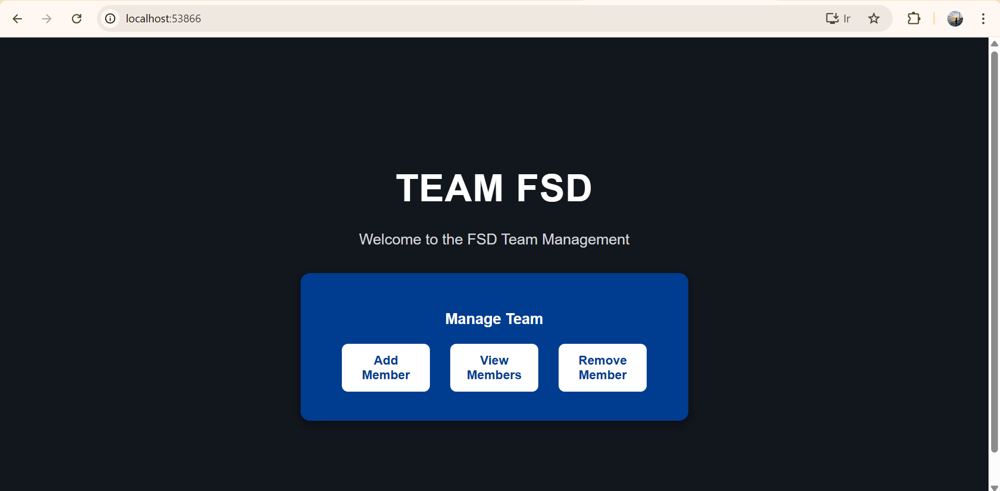
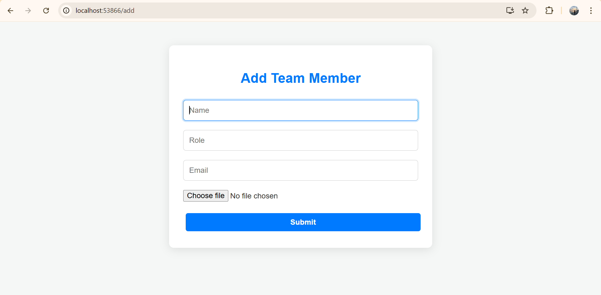
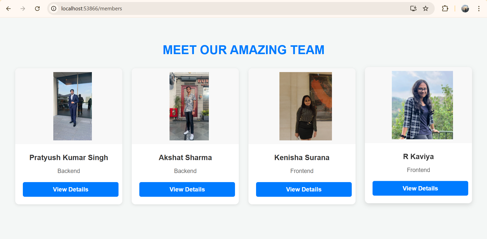
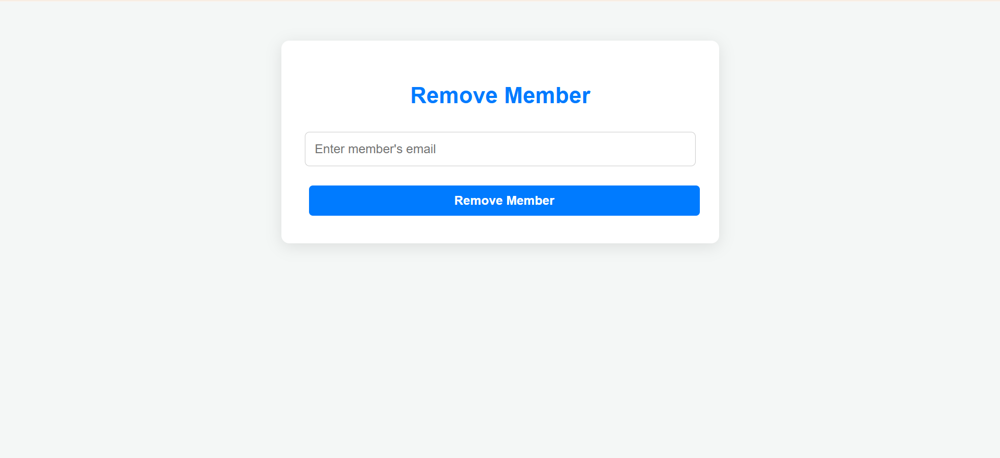
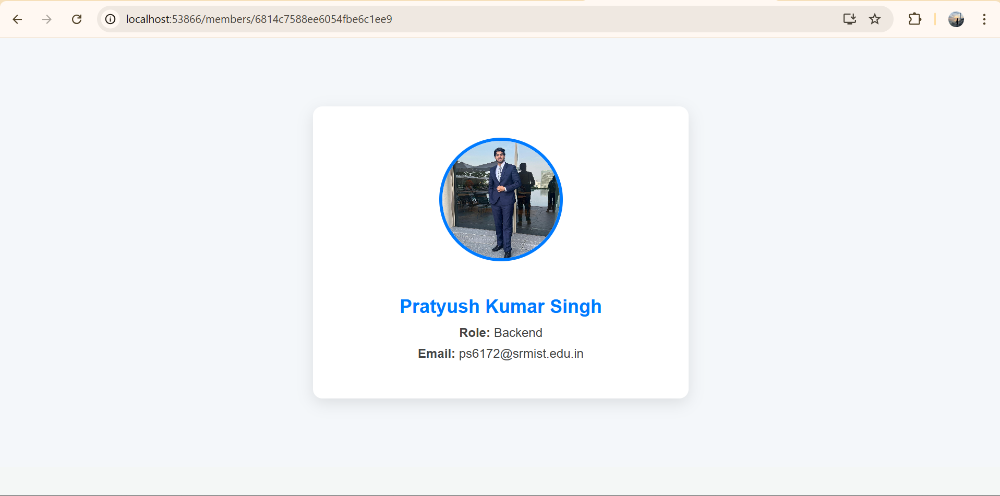
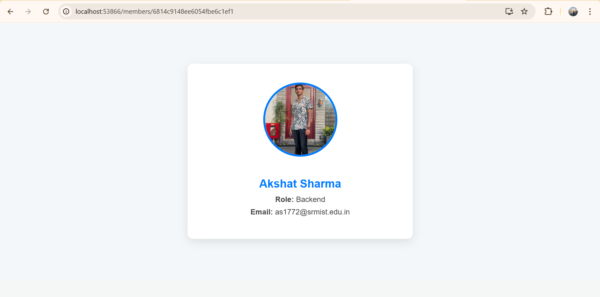
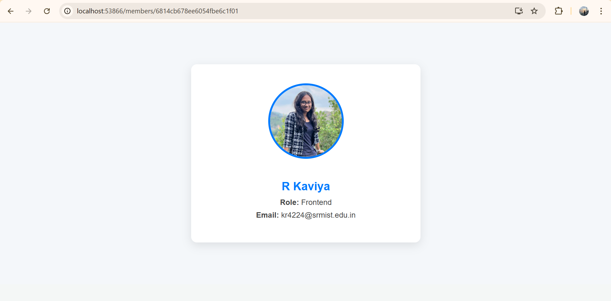
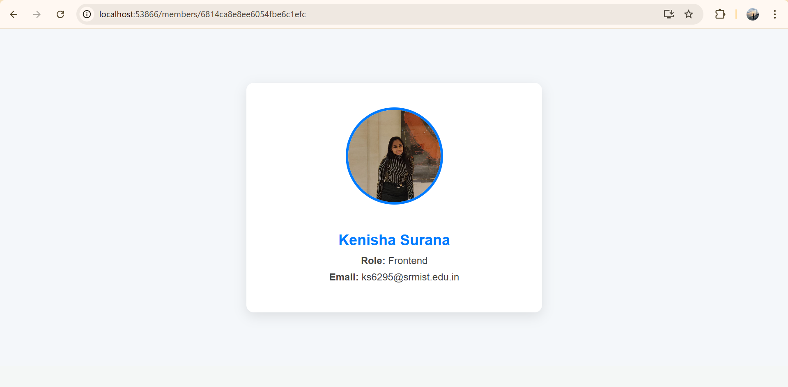

# Team Management Web App

This is a full-stack MERN (MongoDB, Express, React, Node.js) application to manage team members. It allows you to add, view, and remove team members with image uploads and details.

## 📁 Project Structure

root/
│
├── backend/ # Express server & API
│ ├── models/ # Mongoose schemas
│ ├── routes/ # API routes
│ ├── uploads/ # Uploaded images
│ ├── server.js # Entry point for backend
│ └── .env # Environment variables
│
├── frontend/ # React frontend
│ ├── public/
│ ├── src/
│ ├── .env # Environment variables
│ └── package.json
│
├── .gitignore
└── README.md

## ⚙️ Prerequisites

Ensure you have the following installed globally:

- [Node.js](https://nodejs.org/)
- [npm](https://www.npmjs.com/)
- [MongoDB](https://www.mongodb.com/try/download/community) (local or Atlas)

Create .env in /backend
```bash
PORT=5050
MONGO_URI=mongodb://localhost:27017/teamDB
```

Start the server
```bash
cd backend
npm install
node server.js
```

Start the website
```bash
cd frontend
npm install
npm start
```

## 📷 Screenshots
### 🏠 Home Page


### ➕ Add Member Page


### 👥 View Members Page


### 👤 Remove Member Page


### 🧑‍💼 Member Profiles
- Pratyush  
  

- Akshat  
  

- Kaviya  
  

- Kenisha  
  

